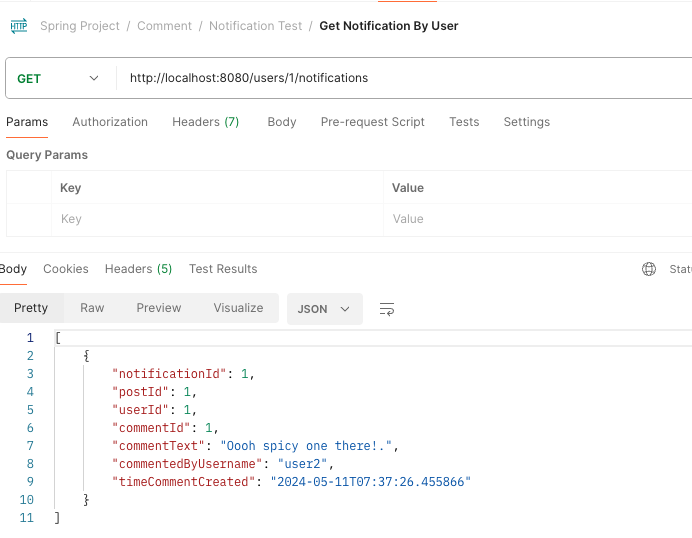
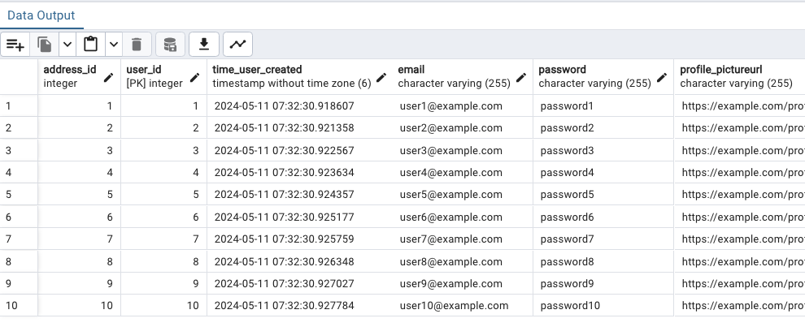

# Inclusive Job Site Refer-All: Backend with Spring and API 

---- 

# Intro
This project was completed early May 2024 as part of General Assembly's Bootcamp, during Week 12 in our course. The code contained in this repo builds the backend functionality for my [inclusive-job-referral-site project](https://github.com/ashleyd480/inclusive-jobseeker-referral-site). The following concepts are used: Spring Boot framework, REST API calls, Spring Data JPA, microservices, and JUnit/Mockito (for testing).


---- 

# Design 
The API endpoints and associated backend code were designed with a user-first approach, considering what actions users would take on my hypothetical front-end site and what would need to happen under the hood. My full list of methods is [here](https://github.com/ashleyd480/referral-site-api-backend/blob/main/spring-referral-main/assets/methods-planning.pdf). Note how throughout the methods and variables are descriptive, allowing for easier code comprehension. 

## User Story
An example front-end flow is:  A user creates an account, and he creates his first referral post to share an opening at his company. He searches for what tags are available and appends tags to his post, or he can choose to add a custom tag. The tag can be added to his post, and he can submit his post. 
Then, he can browse the list of user profiles and click into them to learn more about that user. Afterward, he may go browse the referral posts and to further refine, the use may filter by a tag or by keyword to find the most relevant opportunities. He can add comments to the post, and this sends a notification to that post's author.

## Entities 
We work with users, address, posts, comments, and tag entities, which are mapped in this ERD diagram below. Note: we use `@JsonIgnore` with certain attributes to prevent circular references. For example, Users has a `@JsonIgnore` above posts, so that when we display users, we don't have a long list of posts under the users. Rather it makes more sense to display the username under each post.


Note: 
The following is a note of how the relationships affect specifically how we handle the service logic for `POST` mapping:
- For Many-to-Many relationships, we only have to worry about setting an entity to another.  This is because, with many-to-many, the join table established a bidirectionality between both entities. 
- For One-to-Many, that is a unidirectional relationship, so you have to set both entities "to each other".


### Post

- One-to-many with Comment: 
  - `mappedBy= "post"`: means the Comment entity owns the relationship, and the list of Comments is mapped to each post by Comment's `post` field.
- Many-to-many with Tag: 
  - `@JoinTable` is done from Post, since we query more from posts, and this way when we run a search- the related Tags will display. 
  - `inverseJoinColumn`: tag_id is the foreign key that establishes that relationship with Tag entity by referencing its `tagId`.
- Many-to-one with User: 
  - `@JoinColumn (name = "user_id")` is the foreign key that references the `userId` from User. Each post needs to have a userId (nullable = false)
   - Hibernate then associates the user with that `user_id` to its respective post(s).


### Comment

- Many-to-one with Post: 
  - `@JoinColumn (name = "post_id")` is the foreign key that references the postId from Post. Each comment needs to be tied to a post (nullable= false means a comment must have a post to exist)
  - Hibernate then associates the post with that `post_id` to its respective comment(s).

### User

- One-to-many with Post:
  - `mappedBy = "user"`: means the Post entity owns the relationship, and the list of posts mapped to each user by user field in Post. 
- One-to-one with Address: 
  - `CascadeType.ALL`:  any actions taken on User will be taken on Address; i.e. if a user is deleted, then the corresponding address is deleted
  - `@JoinColumn (name = "address_id")` is the foreign key (referencing addressId from Address) and each user needs to have an address (nullable= false) that is unique

### Address

- One-to-one with User: 
  - We are able to link a user to an address because User has a foreign key of `address_Id`.
 

### Tag

- Many-to-many with Post: 
  - Note: The `@JsonIgnore` over the Posts field does not affect me querying posts by tagId since I use the logic of `return existingTag.getPosts();` in my service method. 
  - `mappedBy = "tags"`: means Post entity is the owning side, and the list of posts is mapped to the tag via the tagId in join table.


---- 

# Functionality
The backend code consists of the [spring-referral-main](https://github.com/ashleyd480/referral-site-api-backend/tree/main/spring-referral-main) and [notification-microservice](https://github.com/ashleyd480/referral-site-api-backend/tree/main/notification-microservice).


## Main App
The core app contained in the aforementioned spring-referral-main allows the following to be done through API endpoints and associated CRUD (create, retrieve, update, and delete) logic. 
(Note:
- For your convenience, I have linked postman-commands.json [here](https://github.com/ashleyd480/referral-site-api-backend/blob/main/spring-referral-main/assets/postman-commands.json) with sample request body data that you can copy and paste into Postman for API calls that require that information. Included are also some `/bulk` endpoint calls that allow you to easily populate the database with some information."
- `@Around` logging aspect using Spring AOP  logs when a service method is called and the time it started and finished its call.)

### Address:
- Display a user's mailing/billing address for merch shipping confirmation with `GET` request to `/address/users/{userId}`
- Update just the billing/mailing address for a user with `PATCH` request to `/address/users/{userId}`, getting the user by id and then updating his/her address and then saving that updated user to the User database.


### Comments
- Allow user to comment on a post with `POST` request to `/comments/posts/{postId}`
- Display comments tied to a post by fetching them with `GET` request to `/comments/posts/{postId}/`.
- Enable a user to edit their comments on a post with `PUT` request to `/comments/{commentId}/posts/{postId}`
- Allow user to delete their comment on a post with `DELETE` request to `/comments/{commentId}`


### Posts
- Enable a user to delete their post with `DELETE` request to `/posts/{postId}` 
- Allow user to create a new post with `POST` request to `/posts/users/{userId}`
- Display posts that match a keyword with `GET` request to `/posts?keyword={keyword}`
- Display posts on the home page with `GET` request to `/posts`
- Enable a user to edit an existing post with `PUT` request to `/posts/{postId}`


### Tags:
- Allow user to add a tag to a post with `POST` request to `/tags/{tagId}/posts/{postId}`
- Fetch posts associated with a tag with `GET` request to `/tags/{tagId}/posts`
- Enable user to create a tag with `POST` request to `/tags`
- Display tags to users with `GET` request to `/tags`
- Allow user to update a tag they created with `PUT` request to `/tags/{tagId}`
- Enable user to delete a tag from a post with `DELETE` request to `/tags/{tagId}`

### User:
- Allow user to create an account by adding their information to the database with `POST` request to `/users`
- Display users in a profile directory by fetching all registered users from the database with `GET` request to `/users`
- Display user info on the My Account page by fetching specific user info with`GET` request to `/users/{userId}`
- Enable a user to update their account info with `PUT` request to `/users/{userId}`
- Enable a user to delete their account with `DELETE` request to `/users/{userId}`


##  Notification Microservice

The notifications operates through a standalone microservice. 

### Trigger Event
The primary trigger for the Notification Microservice is the action of a comment being added to a post. When a comment is posted on a post within my application, this initiates a communication process with the Notification Microservice.
  - When a post gets a comment, it sends comment information (user who commented, commment text, and time commented) and the id of the user who owns the post to this this service using Rest template and register this to the notification database.
  - An endpoint in the main application allows the user to see all notifications for them by user id. 




## API Call 
From Comment Service: Once a comment is successfully saved to the database by the commenting service or controller responsible for handling post interactions, an API call is made to the Notification Microservice.
This call informs the Notification Microservice that a new comment has been posted. It includes all necessary details such as the id of the commented post, the username of the commenter.

  


### My Code Flow 
Now, that you get the overview from above, this is a detailed look into how my code flows. 
1.  To create a notification when a user adds a comment to a post, the Main class utilizes the `addCommentToPost` controller and service method in the Comment class. After we ensure the commment is saved to the database, we can then use getters and setters to pass along its associated post, and user information to a  new `notificationDTO` instance. 
2.  This DTO is passed to the Notification microservice and saved in the Notification database via a `POST` request to `/notifications`.
3. Within the Notification service layer, this `notificationDTO` instance is then mapped back to a notification instance to be saved to the database. Now, the notification from that newly added comment with its associated information is saved.
4.  For displaying notifications to users regarding comments they received on their own posts, the Main class invokes the `getNotificationsByUserId` controller and service method in the User class. This fetches notifications for a specific user by their user ID from the Notification microservice via a `GET` request to `/notifications/{userId}`, resulting in a list of notifications specifically for the user, informing them of comments on their posts.


---- 

# Error Handling
I've included checks for the following scenarios for error handling/edge cases. 
The logic for them are handled in my code with if/else statements. Where applicable, a message is included in the response entity, giving transperancy to users what action needs to be taken if a request did not go through. 

- For our bulk creation of data for testing, we ensure that the list is not empty.
- Users are required to provide an email, password, and username when signing up or editing their account.
- The comment body cannot be left blank when adding or updating a comment.
- Posts cannot be left blank when adding or updating; they must have a title and content.
- When a user wants to create a custom tag, it must include both the tag name and tag description.
- If there are no notifications for a user, they will see a message indicating that there are no notifications available.
- Address updates cannot proceed if any required fields are missing.

For example, in this code block below, if the `post` body is either null or empty, the method will return a bad request status along with an error message to the user. 
Note: You can see how only if the post is not empty is the new post created and added to the database and displayed along with a created http status. 

```
   @PostMapping("{userId}")
    public ResponseEntity<?> addPost(@PathVariable Integer userId, @RequestBody Post postToAdd) {
        if (postToAdd.getPostTitle().isEmpty() || postToAdd.getPostContent().isEmpty())  {
            return ResponseEntity.badRequest().body("Please make sure you provide a post title and content before submitting.");
        }
        else {
            Post newPostCreated = postService.addPost(userId, postToAdd);
            return new ResponseEntity<>(newPostCreated, HttpStatus.CREATED);
        }
    }
```


---- 

# Testing
Comprehensive tests were conducted for all services and controllers using JUnit and Mockito. 
With 25 methods on both the controller and service layer, I wrote sad and happy paths for each- totaling 100 tests that extensively test my logic. My test coverage % report is shown below.


For each layer's test of controller and service respectively, the test isolates the method for that layer to make sure it's doing what it's supposed to, and any other methods and dependencies are stubbed. For any test data that I use when mocking methods, they are in my Test Data class for seperation of concerns, and I'm able to reference the return value of these functions in their respective test class with a private variable. 


---- 

# What I Learned

## Lazy Loading

Even though the User table doesn't have all those address fields, we can still fetch that data through a concept konwn as lazy loading. Because User has a `CascadeType.ALL` with Address, Hibernate will transparently fetch the associated Address entity from the database and provide access to its fields as if they were part of the User entity.




## Non Nullable 
Non nullable means a field must be included when creating an entity. In the case of Posts, the user field is non-nullable in the Post entity definition. This means that when creating a post in Postman, we have to include the user id. This is done through the endpoint URL which has the user id at the endpoint, i.e. `http://localhost:8080/posts/1`

Then, in the service method, you can see how that new post is first set to that user and then the post (that now has an associated user) is saved to the Post database. 

```
   public Post addPost(Integer userId, Post postToAdd) {
        User existingUser = iUserRepository.findById(userId).orElseThrow(()-> new RuntimeException("User with id " + userId + " does not exist." ));
        postToAdd.setUser(existingUser);
        return iPostRepository.save(postToAdd);
    }
```

## Patch Mapping
Patching allows us to just update certain attributes. My `modifyAddressUserId` method allows just a user's address to be modified. We would need to find the user and set that existing address to the new address's information. You can see how we are able to do that modification without needing to send the entire user resource represenation with all its attributes, but rather we would only need to pass along the new address attributes. 

```
 public Address modifyAddressUserId(Integer userId, Address newAddress) {
        User existingUser = iUserRepository.findById(userId).orElseThrow(()-> new RuntimeException("User with id " + userId + " does not exist." ));

        Address existingUserAddress = existingUser.getAddress();

        //Now let's update the address for that user
        existingUserAddress.setStreet(newAddress.getStreet());
        existingUserAddress.setCity(newAddress.getCity());
        existingUserAddress.setState(newAddress.getState());
        existingUserAddress.setZipCode(newAddress.getZipCode());
        existingUserAddress.setCountry(newAddress.getCountry());

        // save updated user to cascade the changes to the address 
        iUserRepository.save(existingUser);

        //return updated address
        return existingUserAddress;
    }
```

  
# Thinking ahead

## Model Mapper 
For my update methods, we can use the ModelMapper dependency. This allows us to make changes without having to write a set statement for each of the entity's attributes. 
For example, the method to update a user's address would look like this with model mapper.

```
import org.modelmapper.ModelMapper;

public Address modifyAddressUserId(Integer userId, Address newAddress) {
    // Find user by id
    User existingUser = iUserRepository.findById(userId)
            .orElseThrow(() -> new RuntimeException("User with id " + userId + " does not exist."));

    // Map the properties from newAddress to existingUser's address
    ModelMapper modelMapper = new ModelMapper();
    modelMapper.map(newAddress, existingUser.getAddress());

    // save updated user to cascade the changes to the address
    iUserRepository.save(existingUser);

    // return updated address
    return existingUser.getAddress();
}

```

## Validating non-empty input
As we saw earlier, I used if/else statements to prevent empty comments, user info, etc when doing a post/update/patch mapping. However, a simpler way is to use Spring's built-in validation. In my entity, such as Comment, I can use the @NotBlank annotation above attributes that shouldn't be blank. 

```
  @NotBlank(message = "Comment text cannot be blank")
    private String commentText;
```
Then, in the Controller layer, you will want to use the @Valid on the request body. That is what actually triggers the validation process defined in those annotations.

```
public ResponseEntity<Comment> addCommentToAPost(@PathVariable Integer postId, @Valid @RequestBody Comment commentToAdd) {
    // Your logic to add the comment to the post
}
```

## Foreign Key Constraint
With my current design, a user's posts need to be deleted first before a user can be deleted. This is due to the foreign key constraint. In other words, the Post entity has a foreign key of user id that references the User entity. This means that on the front end, before a user can delete his or her account, a message would pop up to confirm that his or her posts would be deleted; upon confirmation- the posts would be deleted and that would then allow the user to be deleted.

Currently, I only have a method to simply delete a post. However, to make things easier, I could do add a delete posts by user method- first finding the user and his/her posts, and then deleting that. 

Alternatively, here is another idea (revisitng after learning React) and credit to an amazing current front-end SWE for sharing this advice: "Instead of deleting the user, we could set their state as deleted and still keep their posts.  When a person is deleted, their name is set to "Deleted user", but then the rest of the database will still work." 

A third idea would be adding the `CascadeType.All` to to `posts` under Users, which would resolve the foreign key constraint issue of being unable to delete users due to users being tied to posts. `CascadeType.All` would essentially just delete the associated posts when a user is deleted. 


## Testing Best Practices
Two things I would have done differently in my testing:

1.  While initially I assumed that I have to mock every single line of code in my tests, I learned that if we do that, it may not correctly test. For example, in my test of the service method `addTagsToPost` it would not make sense mock the lines where a tag is added. This is similar to someone giving you the answers on a quiz- did you really know the ansewr or was it because the answer was fed to you? Same concept here. 
`addTagsToPost` returns a tag so we check that with the `assertEquals(testTag, result);`. Also, `addTagsToPost` is adding tags to a post, so we check if that method actually works in adding the tags to a post with the following below: 

```
  List<Tag> updatedTags = testPost.getTags();
  assertTrue(updatedTags.contains(testTag));
```        

2. Another thing is when testing, we can keep the test code DRY by seeing if we are perhaps testing for duplicate logic. 
In the example code below, if `assertEquals` is true, then `asserNotNull` must also be true. That's because if the result were null, `assertEquals`wouldn't work.

```
assertNotNull(result);
assertEquals(testTag, result);
```
